# 设计模式概述

- 文章有很大一部分参考了 https://refactoring.guru/
- **不过不建议通过这个网站进行设计模式的学习**。可能是为了给设计模式进行准确定义，其内容经常比较抽象，让人难以了解到模式的目的。并且它在介绍时还顺便介绍了很多变体和综合，常常让读者觉得毫无重点，有点强行分类和定义。**但是可以当作目录使用。**
- 比较建议的学习方式是去 StackOverflow 上询问实际场景
- 您可以先了解一下 [UML 图](https://cloud.tencent.com/developer/article/1684161) 的常用图标含义

## Clean Code

**在进行“设计”之前，首先应该明确设计的目的。**

一切关于代码结构，代码功能的研究和准则，无非是为了让代码更加适应开发需求，或者说，更加 **"Clean".** Clean code 是一个非常主观，复杂且多方面的定义，但是在继续了解 design pattern 时，不妨将其归结为以下几点：

1. **Obvious**
   1. 清晰易读，逻辑明确的代码
2. **No duplicate**
   1. 没有不必要的重复
3. **Accept change**
   1. 接受一定的修改和扩展
4. **Pass all test**
   1. 当然，好的代码必须（至少看起来）工作良好 x

> 关于更多 clean code 的内容，可以参考 [《Clean Code》阅读与总结](https://xn4zlkzg4p.feishu.cn/wiki/wikcn4Dkcyyu5KfA5R0MgYP8y6f)

## Refactoring

> 抛开实际语言和代码的重构讨论将会逐渐变成抽象的哲学
>
> 这不是我们希望看到的
>
> 所以这部分讨论将尽量局限于可以比较没有争议，可以作为 COC 的内容

Clean code 看起来非常简单而愉快，但是让自己的代码变得 "clean" 并不如想象中的容易。

人们在编写代码时往往是盲目且懒惰的，为了修正丑陋的代码，将会对代码进行**重构**。

**之所以在讨论设计模式前先讨论重构，是因为重构的目标很直接地指向了 clean code 的标准，而之后的设计模式无论再复杂，其核心目标和简单的重构是差不多的。**

### 简单直观的重构

Clean code 的准则定义得十分模糊，我们很难对着一份代码争辩它是否 "accept changes"。好在，不好的代码会产生一些明显的特征，我们称之为 **"Bad Smell".**

通过直观的 bad smell 可以让我们发现代码的深层缺陷。

#### Improper Name

**不恰当的命名** 是最常见的 bad smell。我们先抛开那些因为偷懒而产生的命名失当，命名不恰当侧面反应了这段代码难以被命名。

比如，当一段代码过长，逻辑过于复杂时，我们就很难为其命名，同理，过于膨胀的类也会难以命名。我们会发现这些差劲的名字要么不能概括其功能，要么里面充斥了一名词，明显是由很多个句子组成。这种情况我们一般称为 **Bloater.**

而解决这个问题的重构方法也很简单，概括为一个字就是“拆”，将长函数分隔为短函数，将巨大的类分为几个小类。遇到复杂的条件句，就将其拆成一个 checker 函数，发现纠缠不清的变量，就用一个 query 函数来替代它。

```Python
# before
def BigFunc():
    # ...
    do something

    # ...
    # logic about variable qwq
    # ...

    if a > 100 or b < 1000:
        return qwq
    else:
        return 0

#   ⇩⇩⇩
#  refactoring
#   ⇩⇩⇩

# after
def func():
    # ...
    dosomething()
    # ...

    if checkRangeOfAB(a,b):
        return queryQwQ()
    else
        return 0

def dosomething():
    pass

```

借此，我们能将庞大交错的逻辑区分的清晰明了。同时，你会发现很多情况下，过度膨胀的代码包含了许多重复的部分，重构也是在解决 duplicate 的问题。

#### Primitive Obsession

除了命名造成的困扰，大量变量同样会造成代码易读性下降，想象一下使用下面这个类：

(感觉 python 因为动态类型不好举例，换成了 C#)

```C#
public class Person
{
    public string ID {get;set;}
    public string Name {get;set;}

    public string Address {get;set;}
    public string PostCode {get;set;}
    public string Country {get;set;}
    public string City {get;set;}
}
```

虽然已经进行了小小的分段，使得代码好看了许多，但是这么多变量还是非常抽象的。而且，它们都是 "primitive type" 的变量，也就是说，其类型的含义不足以表达变量的意义。

在上面这个例子中，我甚至不想给出它的构造函数（懒）。想象一下，这个构造函数将是一长串 `string` 变量，在不断重复调用它的过程中，大概率会有一次会把 `city` 和 `country` 字段写反！

因此，我们要将 primitive 包装成新的结构体（我们姑且先称结构体，因为这里还不想提及它们作为 “类” 的特点），一方面，这样**强化了 primitive 的意义**，另一方面，这样使得 primitive 有了**类型安全**性：

```C#
public class Person
{
    public Person(string Name, Address adress)
    {
        // init
    }

    public PersonID ID {get;set;}
    public string Name {get;set;}

    public Address Address {get;set;}
}

// strong-type & read-only id
public readonly struct PersonID : IComparable<PersonID>,
IEquatable<PersionID>
{
    public string ID {get;}

    // overload equals compare new .....,
}

// Address class
public class Address
{
    public Address(string detailAddress)
    {
        // parse
    }

    public string Address {get;set;}
    public string PostCode {get;set;}
    public string Country {get;set;}
    public string City {get;set;}
}
```

#### Comments are bad

写代码加注释常常被认为是一个好习惯，但是在某种意义上，注释其实是坏文明！

注释的作用是对代码进行解释，但是，除了一些对复杂算法进行来源注明的注释，或者对于一些特定的怪异操作进行解释的注释，剩下的注释其实是不必要的。反而，依赖注释会使得代码本身正确命名和分块的需求减小，会**掩饰代码的 bad smell**。

### 考虑 “代码结构”

在直观的 bad smell 的引导下，上述的重构方法应该能快速地改造代码。

但是，在不断抽离方法后和结构体后，代码会被它们塞满。这些方法应该放在哪？如何将一个简单提取的结构体变成一个设计良好的类？这是应该进一步考虑的事情。

#### Extract class

从开始考虑如何构建一个类，如何考虑类的关系起，我们就已经进入了 oop 的领域。

经过之前的重构，将处理一类数据的 “过程” 提取为 “类” 其实是非常自然的事情。

一个思路是从 **data clump** 开始，首先将绑定的数据块封装进一个 struct 中，然后通过寻找和这些数据有关的函数，将它们重构为类的方法。

典型的例子是 **Introduce Parameter Object，**这是一种简化超长参数列表的重构方法。这种方法就是先将参数列表封装进一个类中，然后再将使用这个参数列表的函数，和一些预处理出参数的过程封装进类中，就能得到一个比较完善的类。

另一条路是从 **method object** 入手，首先从代码逻辑考虑，分离出若干函数，然后再寻找其共同的依赖变量，将这些变量封装成一个类。当重构的 "long method" 局部变量比较混乱时，直接抽离出函数会耗费很多精力传入重复的参数，这种提取类的方法就会比较好用。

我们希望提取的类职责尽量单一，所以在经过简单的 extract class 后，可能还需要进一步抽离类来分离职责。

> 参考后文的 [SRP](https://xn4zlkzg4p.feishu.cn/docx/Kf2Gd8GcTob1iUxiw2ScwN0anGh#TYaedyic0owkksxJNYjcysYjndI)

出现正交的扩展方向，是一个类有多个职责的信号。

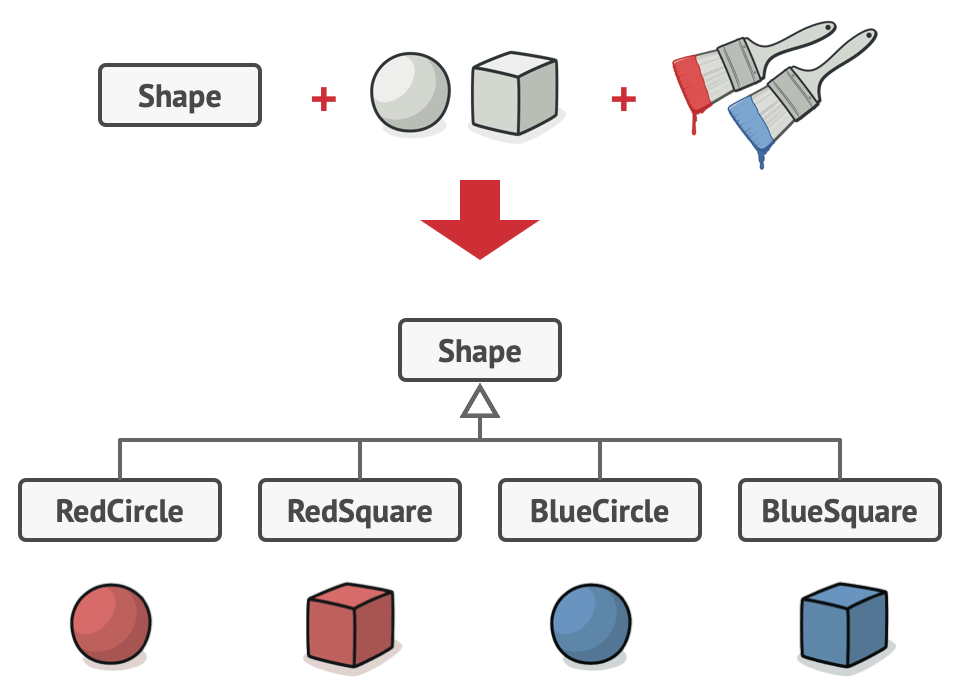

例如上图中的 shape 和 color 明显是两个不同维度的扩展，如果两者在同一类中扩展，任一方向的扩展都将影响到另一个方向。故将两者抽离才是正确的选择：

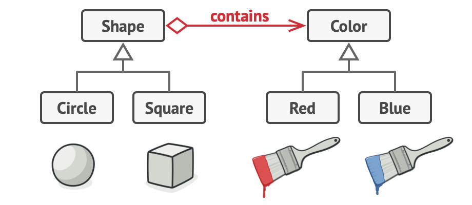

这种将一部分功能委托给另一个类的做法称为 **delegation。**

#### Change Preventer

我们最后从 **accept changes** 的角度来考虑 bad smell.

《clean code》给出了两种 **change preventer**：

- Divergent change
  - 这个词是相对于一个正在维护的类而言的，形容如何无关的 外部/内部 修改都会迫使该类进行修改。
  - 对内部修改来说，这可能是因为内部职责混杂
  - 对外部修改来说，这可能是因为该类外部依赖过多
  - 可以被称之为 **“high coupling”**
- Shotgun surgery
  - “散弹式修改”，形容修改任何一个功能都要在代码的各处做修改
  - 可以被称之为 **“low cohesion”**

### Something Deeper

上面的重构会引起一些难以直接解决的问题。

比如在经过一次封装后，我们发现其中一个类内成员频繁地被另一个类使用，这可能意味着目前这个成员的位置是错误的。再比如，有一些子类几乎没有用到它们父类的成员，这说明目前的继承结构是不合理的。

还有一些 **oop abuse** 的问题。比如不关注对象内数据的 accessibility ，或者使用一个 **big switch** 来代替多态的 **dynamic dispatch**。

> 所以说 golang 判断 type 的 switch 语句的语法糖简直是败笔中的败笔（个人观点）

可以发现，当我们讨论的 bad smell 越发抽象，越发涉及到代码结构，涉及到 oop 时，直观的重构似乎已经不起作用，必须深入对于代码结构设计的讨论。

## OOD Principle

> OOD 即面向对象的设计。

我们经验性地提出几个原则，作为设计模式的准则。

其中除了 Least Know Principle 以外的五个常被称为 **“SOLID” 原则。**

虽然称为原则，它们其实是经验性的批判标准。在之后的设计模式中，多少违反这些原则的例子也并不少，切不可将这些条例当作教条。但是在设计代码时，应该经常思考违反它们可能对代码产生的影响。

### Dependency Inversion

依赖倒置原则认为，一个分层的依赖结构，高层部分不应依赖低层部分的模块。而应该对低层模块进行抽象，高层系统依赖其抽象，低层系统模块也依赖抽象实现。

如下图所示，左图中， `Project` 类直接依赖于具体 `Developer` 类的实现是很丑陋的，如果有新增的 `Developer` 类型或者其内接口有改动，都会引起上层更改。

优雅的做法是两者之间通过一个 `Developer` 接口进行对接，这样两层之间的耦合就大大降低了。

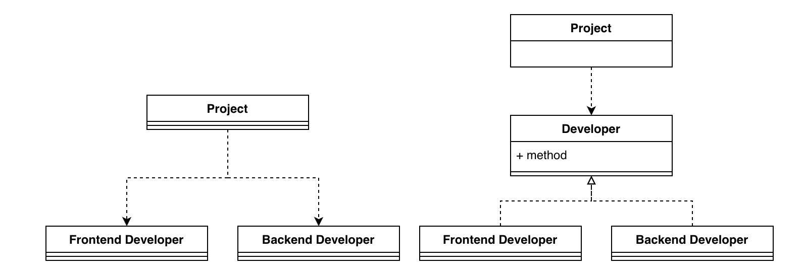

原来的结构是上层依赖于下层，往往上层开发要等待下层完成再进行。而新的结构中，上层不再依赖于具体的下层对象，故称依赖“倒置”。

### Open Close

对扩展开放，对修改关闭。

开闭原则要求代码提供高扩展性，当需要增加功能时，通过扩展而不是修改原来的类或接口来增加功能。

不过这里的修改，一般指不修改 public 成员，对 private 也限制就太过严苛了，而且从 ducktype 角度来说，我们一般也只关心对象对外展现的性质。

开闭原则其实是进一步强调多使用接口，其建议将整个代码结构建立在接口上。这样当我们需要扩展时，就可以重新实现一个接口，而不是修改原来的类。

```Python
class IEducation(Interface):
    def start(self):
        pass

    def evaluate(self):
        pass

class Course(IEducation):
   def __init__(self):
       self.classname = "";
       self.teachername = "";

class VideoCourse(Course):
    def __init__(self):
        super().__init__()
        self.videourl = "";
```

如上，`VideoCourse`通过实现接口 `IEducation`扩展功能。框架逻辑基于接口而非具体的类，新的扩展类不会破坏原有的代码。

### Liskov Substitution

所有接受一个父类对象的地方，必须可以（在语义正确性和行为正确性上）无痕接入其子类的对象。

里氏替换原则严格限制了继承的使用，我们直觉认识的很多继承方式并不能在 oop 中成立。

最常见的例子就是 “正方形是一类特殊的长方形”。

我们确实可以很容易地通过继承和 override 实现一个正方形类（这个实现其实违背了开闭原则）。但是，如果我们要求长方形有设置长和宽的能力，正方形类是无法满足的。从这个角度上来看，正方形不能继承长方形类！**我们的继承要求从 “is” 强化成了 “\*\***act\*\* **exactly like”。**

```Python
class Rectangle:
    def __init__(self):
        self.width = 0
        self.height = 0

    def setW(self,w):
        self.width = w

    def setH(self,h):
        self.height = h

class Square(Rectangle):
    def setW(self,w):
        self.width = w
        self.height = w

    def setH(self,h):
        self.width = h
        self.height = h

# 子类 Square 在这部分逻辑中表现和父类不同
def test(x : Rectangle):
    x.setW(10)
    x.setH(20)
    print x.width
```

那我们该怎么表示上述这种 “A is a special kind of B” 这个关系呢？

答案是进行更高层的**抽象**。在关于长方形和正方形的例子中，我们要求的功能过于具体了，在这个具体的意义下，要求正方形是长方形的子类本就是不合理的。

若是两者通过抽象类来关联，就避免了这种具体场景的使用，其关系就变得合理起来了。

#### **subtyping is NOT inheritance**

继承其实并不是 oop 的必需项。

继承严格来说只是一种代码 reuse 的方法，只是同时带有了一定的泛化关系。

里氏替换原则其实就是在限制以代码复用为目的的继承，破坏了类之间的逻辑关系，或者破坏 OOD 的其他原则，从而对整个代码结构产生坏影响（比如经常因为继承被违反的开闭原则，因为违反里氏原则的继承大概率会进行 override ）。

所以：

- 当你尝试用继承来表示关系时，请先思考这两者的抽象层级是否有上下级关系，否则请抽象一个更高层的接口来关联两者。
- 当你尝试用继承来复用代码时，也请先考虑其连带的继承关系是否合理，否则请使用组合或者代理来复用代码（这些在 Design Pattern 部分会有详细讲到）。

### Single Responsibility

类的职责应该尽量“单一”。

单一职责使得代码清晰分离，易于定位错误和修改功能。

例如我们要实现一个员工类，同时要实现计算工资的功能。如果我们这样设计：

```Python
class Employee:
    def work(self):
        pass

    def getSalary(self):
        pass
```

此时，如果工资计算逻辑改变，我们将会到这个类中修改。

然而，我们其实可以想到，计算工资和工作两个逻辑起始较为分离，如果放在一个类中，将会增加工作和计算工资两个部分的耦合，且这个类也变得更难维护。

如果我们再实现一个类似于“财务部门”的类，由其计算工资，将会优雅许多：

```Python
class Employee:
    def work(self):
        pass

class FinancialApartment:
    def caculateSalary(self,employee):
        pass
```

因为单一是个较主观的标准，有时这个准则会难以判定。但是这个准则时刻在提醒我们，在开发中不要为一个类增加多个功能，而是新建类来分离这些功能。

当发现类和其他类间有复杂耦合，或者私有方法过多且繁琐，不易命名（名词过多），就应该思考是否应该拆分职责。

## Interface Segregation

类似单一职责原则，接口实现也应该尽量简单分明。

两者区别在于，单一职责原则往往比较直观，只需着眼于当前类。接口隔离往往牵扯到层级关系，既要从下层思考实现该接口的冗余情况，也要考虑到上层代码中是否需要将不同逻辑拆分开。

譬如要实现餐馆的线上/线下点餐功能，如果这样定义接口：

```Python
class ICustomer(Interface):
    def order(self):
        pass
    def orderOnline(self):
        pass

    def pay(self):
        pass
    def payOnline(self):
        pass
```

这个接口就显得冗余且不够抽象。实际使用时，实现该接口的新类会相应变得繁琐，而且会经常出现不能实现一部分接口的类。上层代码与下层代码的耦合程度，也因为不够抽象而提高。

首先解决抽象的问题，我们可以不关心操作的途径，只抽象出支付和下单方法，具体细节交由实际类实现。在抽象完之后，我们可以再考虑进行职责的拆分，将原接口分为两个：

```Python
class IOrder(Interface):
    def order(self):
        pass

class IPayment(Interface):
    def pay(self):
        pass
```

和单一职责原则相似，这个原则的评定也比较主观。

在上面这个场景中，假设我们想要对线上订单新增评价功能，若不拆分接口，旧的类实现都需要增加新的评价方法，这样看来，接口的拆分确实有减少耦合和冗余的作用。但是若只关注支付和点单两个方法，这个拆分会让人觉得太麻烦。所以拆分粒度还需根据具体情况斟酌。

### Least Know

一个对象应该和尽可能少的对象有接触。

严格来说，类 `C` 中的方法 `M` 能直接访问的类应该只有：

- `C` 和 `C` 的成员的类
- 传入给 `M` 的参数的类（能访问的全局变量视作此类）

换言之，LKP 要求在 `M` 中能够访问的只有和其“直接接触”的类，通过降低不必要的非直接沟通来降低类之间的耦合。直观来讲就是 “尽量少用 `.`”。

```Python
class C:
    def __init__(self):
        self.component = B()

    def getName(self):
        return self.component.name

class B:
    def __init__(self):
        self.name = "qwq"

ins_c = C()
# 这是不合理的使用方式
print ins_c.component.name
# 这是合理的方式，即 "tell instead of ask"
print ins_c.getName()
```

实际情况下，我们可以用 "tell instead of ask" 的方式来简化代码，将 `M` 中的需要写在参数类的方法里。

但是这种做法会在相应参数类里增加相应方法，这些方法可能是多余的，如果为了满足 LKP 产生了很多冗余方法，则应该考虑更改整个结构的设计，比如干脆将需要间接访问的类直接联系到当前方法中

## Design Pattern

- 大多数模式的代码示例都可以在 [refactorign.guru](https://refactoring.guru/design-patterns) 找到，并且有多种语言的版本
- 因为目的是在介绍设计模式，几乎没有提到使用设计模式为代码带来的 **复杂性** 这一缺点
- 不要生搬硬套设计模式
- 文章将尽量从缘由开始介绍设计模式，希望这能帮助理解

### Structure

#### Use Interface

设计模式将会用一半的时间使人明白 **interface** 的神奇之处。

类的内部实现对于依赖它的代码来说并不重要，甚至其对外暴露的成员变量也不是很重要，可以使用 getter 和 setter 来替代。client code 只关心它能怎么给依赖传递参数，以及能从依赖得到什么结果。

也就是说，一个类真正被依赖的是它的方法。因此，使用 interface 来表示依赖就显得非常自然。

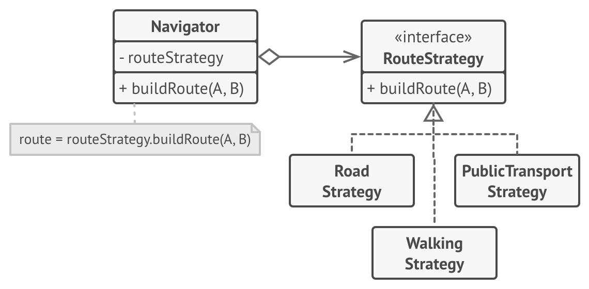

回顾我们之前提到的 **DIP** ，interface 使得上层依赖于一个下层的抽象，几乎将上下层的耦合降至最小。

如上图的例子，一个导航应用只关心寻路依赖返回的路线，如果以 interface 的形式建立依赖，上下层的耦合就只在接口的形式上，下层可以以各种方式进行扩展，上层开发也可以不关心下层的实现。

#### Command

有时候上层依赖下层的方式会很麻烦。

以一个文本编辑器的 GUI 为例，其底层是一个有基础功能的编辑器。 GUI 调用的功能十分复杂，比如剪切功能，它可能需要先调用编辑器移动光标，再调用 pastebin 将选中的内容暂存，再将这部分删除。

这个 GUI 可能可以通过按钮和快捷键进行剪切，于是这段复杂的调用依赖代码可能会被重复，这意味着调用逻辑被耦合到了 GUI 的代码中。另一方面，当调用逻辑过于复杂时，“调用” 本身变成了对上层 GUI 代码职责的污染。

命令模式将 “调用” 依赖的过程封装进一个 `command` 类中。

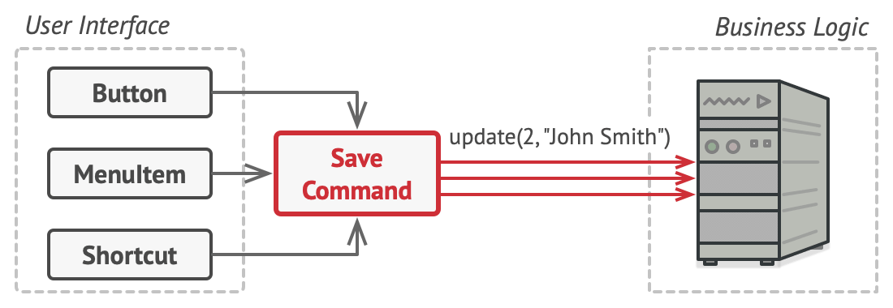

你可以想象它实现了一个控制编辑器的 “遥控器”， GUI 将不直接调用依赖，而是通过 “遥控器” 的命令来控制依赖。


如上图所示，底层编辑器作为命令的接收方注入到 command 中，命令参数可以作为 command 的成员进行设置，而 command 的 execute 方法就是具体的底层调用逻辑。

上述流程的依赖方式可以依具体情况调制。

如果像上述场景一样，command 和 receiver 的依赖比较固定，可以直接将 receiver 定义为 `editor` 类型。如果 receiver 有扩展需求，那么可以选择定义为接口，由 client code 进行依赖注入，或者实现一个 factory 获得特定 receiver 的 command.

而 client code 这边也可以选择直接依赖于具体的 command 类。也可以为 command 再抽象一层接口，方便统一对 command 进行操作和实现 factory.

> [Factory](https://xn4zlkzg4p.feishu.cn/docx/Kf2Gd8GcTob1iUxiw2ScwN0anGh#VcCudk0ysomKCGxAnG4cPq6an8e) 模式见后文

Command 模式有一些非常有趣的应用，因为具体的 command 可以被实例化成单独的对象，我们可以对每一个命令进行操作。比如，在 command 接口上实现一个 `undo` 方法来进行撤销操作。

这种应用可以用来实现编辑器的历史功能：

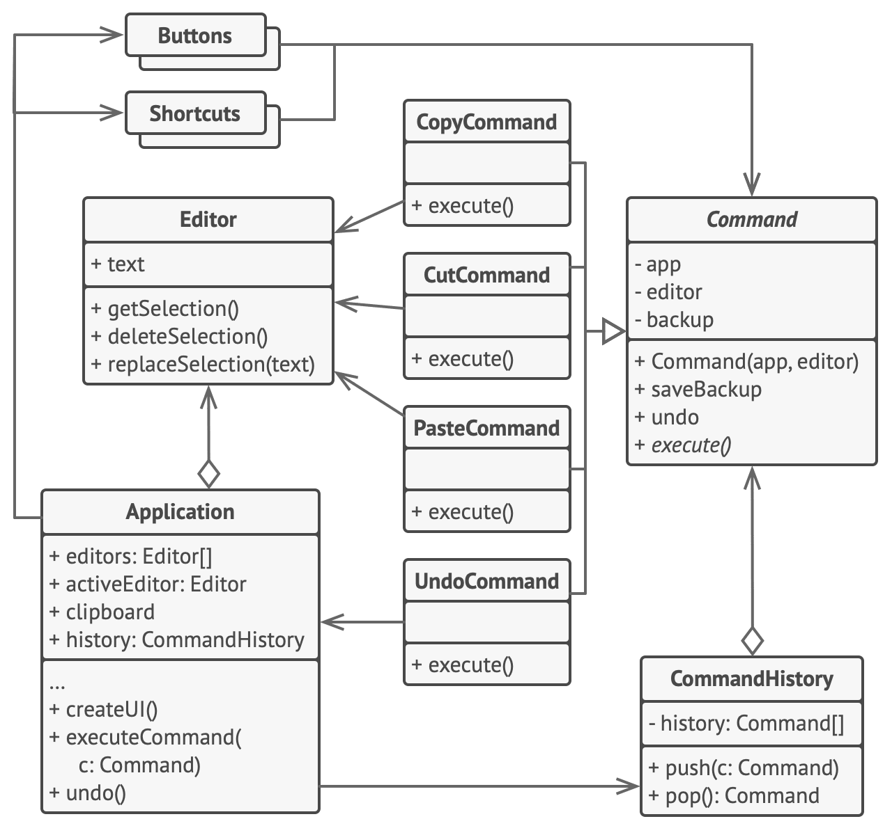

#### Visitor

Visitor 是一种牺牲了一定扩展性的设计模式。

**Visitor 模式可以统合难以通过抽象统一接口的依赖。**

举个例子，一支部队拥有很多兵种和一个指挥官，在这里，指挥官就是我们的 client code，而我们需要统一 “士兵” 这个依赖。一般来说，我们会为士兵抽象一个 “进攻” 接口，这样指挥官只需要调用这个接口就能让士兵进攻，不用管这个士兵是步兵还是骑兵。

但是问题来了，如果这些兵种里不仅有作战的士兵，还有医疗兵等等，他们的功能和作战兵种的差别太大，难以抽象成 “进攻” 这个接口。若是统一成一个更抽象的接口 “行动”，我们又要在给接口传参上下一番功夫，而且这种过于抽象的接口也失去了接口本应有的 “协约” 功效。

当然，我们还有一个充满 bad smell 的原始做法 —— **big switch**！既然无法用接口进行抽象，不妨尝试对这种方法进行改进。

```Python
# client code
if isinstance(obj,classA):
    # ...
elif isinstance(obj,classB):
    # ...
else:
    # invalid
```

我们知道，使用接口的好处之一是其 **dynamic dispatch**，即当调用方法时，实际对象会根据自己的类型 "dispatch" 自己所属类型的方法。而我们使用 switch 其实就是在手动进行 dispatch。

但其实，在使用 switch 时，每个对象还是知道自己的类型的。那么，我们不妨不主动判断其类型，然后分配正确的方法，而是将所有的方法都提供给对象，让对象自己选择正确的调用方法。

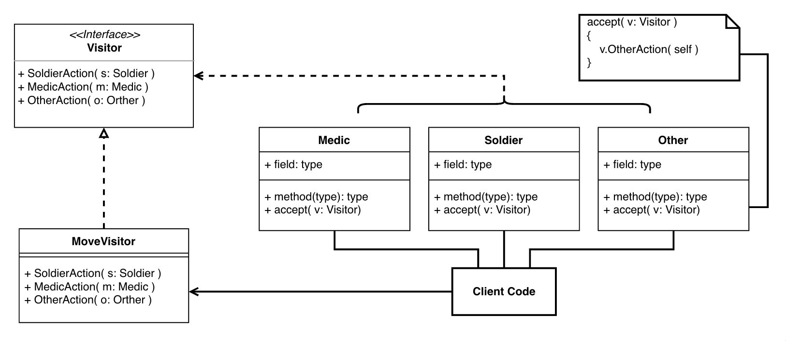

通过将判断和选择工作委托给类本身，我们实现了一次静态的分配。而通过实现 `Visitor`接口，我们也能进行方法的扩展。这种结构被称为 **double dispatch.**

上述例子中，`Medic` `Soldier`等都是类依赖，我们完全可以将它们都改为接口依赖。如此一来，我们相对于静态分配了几个大类，而每个大类可以通过接口各自实现不同的扩展。

如果最上层的分类足够稳定，**Visitor 模式还能提供一个比较简化的方法扩展方案。**

我们在扩展方法时，秉着 **OCP** 和 **ISP，**一般来说会新定义一个功能接口，然后定义新类实现这个新接口，将原来的类通过 compose 的方法关联到新类中：

> 通过继承进行扩展是极其丑陋的行为！
>
> 而且通过继承来扩展产生的全新的扩展对象，要对现有的对象做扩展不如通过 compose 来的方便。

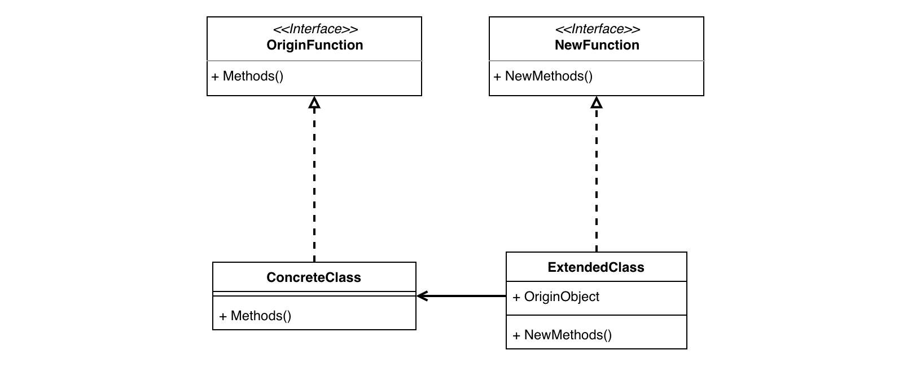

而在类足够稳定，基本不会进行扩展的情况下，我们可以用 Visitor 实现功能扩展。在实现了 Visitor 模式的基本结构之后，扩展新的 Visitor 是非常方便的。我们只需新实现一个具体的 `Visitor` 类，从步骤来说比一般的方法简便，而且增加一个功能只需要实现一个类，避免了代码中的类快速增加，变得冗长。

> **Visitor 模式进行功能扩展的本质原因，是其类似于 Command 模式的调用方法，所以说 Command 模式也能这么扩展功能。**

### **Creation**

#### Factory

Factory (工厂)，是一种关于创建实例的设计模式。

一般来说，一个支持 oop 的语言会以与类同名的函数作为一个 constructor，以直接调用 constructor 或者使用 new 的方式来新建实例 。

但是当我们需要多种创建逻辑时，在 constructor 里增加太多参数和 conditional 是非常不优雅的。这时我们会想要有多个构造方式，一个好办法就是在类中加入几个 static method 作为额外的构造器。这种静态的 creation method 被称作 **Static Creation Method**。

静态的构造方法有很多优点：

- 当有大段逻辑需要在调用 constructor 之前完成时，我们可以将其封装在 static method 中，以免 construor 中有太多构建之外的逻辑。
- 其返回值不一定是一个当前类的 instance，你可以返回其 subtype ，这对多态实现很有帮助。
- 其不必要真的新建 instance，而是选择复用已有实例，这可以帮助资源密集型应用节省开支。
- 其命名可以自定义，所以可以更清晰地表达 constructor 的逻辑。

我们暂且从这种代替原本 constructor 的方式，回到设计模式意义下的 factory。**Factory 是一种讨论如何创建依赖类的模式，或者说，是一种 “注入” 模式。**

我们尝试从一段代码的重构过程理解 Factory:

1. 想象在一段 client code 中，有大量对 `Product` 类的依赖。
2. 我们试图降低这份代码和 `Product` 类的耦合程度，一般来说就是实现一个 `IProduct` 接口，将关于 `Product` 类的逻辑抽象出来。
3. 然而，抽象接口虽然解决了大部分 coupling，但是创建实例的部分仍然和 `Product` 类联系紧密。
4. 为了解决这个问题，我们可以将所有创建实例的代码提取出来，全部交由一个 static creation method 实现，这样我们的代码与 `Product` 类就只在这一处耦合了。

这个 static creation method 就是 Factory 模式的原型，被称为 **Simple Factory**。

```Python
# Product
from abc import ABC,abstractmethod

class IProduct(ABC):
    @abstractmethod
    def getName(self):
        pass

class ProductA(IProduct):
    def getName(self):
        return "A"

class ProductB(IProduct):
    def getName(self):
        return "B"
# Client Code
# import ...

def factory(name):
    if name == "A":
        return ProductA()
    elif name == "B":
        return ProductB()
    else:
        raise Exception("Invalid parameter")
```

上面 Simple Factory 的一个最简单的例子。通过抽象出的 `IProduct` 接口，可以实现多种 Product，这意味着我们要不断修改 Simple Factory 的 creation method，最终其会被 switch case 充满。

本着开闭原则中 “尽量不通过修改来增加功能” 的想法，我们尝试寻找一种通过扩展，而非修改来实现增加 Product 类别的模式：

1. 将这部分 Client Code 封装在一个 `Creator` 类中
2. 在这个 `Creator` 类中创建一个 abstract method 作为 factory method
3. 对于不同的 Product 类别，比如 `ProductA` ，创建一个新的 `CreatorA` 类并继承 `Creator`。
4. 补充其 factory method 为创建 `ProductA` 实例
5. 其他类别的 Product 同理

（步骤 3 可以斟酌保留相似的 Product 在同一个 Creator 类中，使用 `switch` 进行区分）

```Python
# Creator
# import ...

class Creator(ABC):
    def clientCode(self):
        product = self.createProduct()
        # ...

    @abstractmethod
    def createProduct():
        pass

class CreatorA(Creator):
    def createProduct():
        return ProductA()
```

这样我们就能够通过扩展抽象类 `Creator` 和接口 `IProduct` 来实现对原结构的无痕扩展。因为将原来的静态函数变成了类的方法，我们称这种模式为 **Factory Method**。

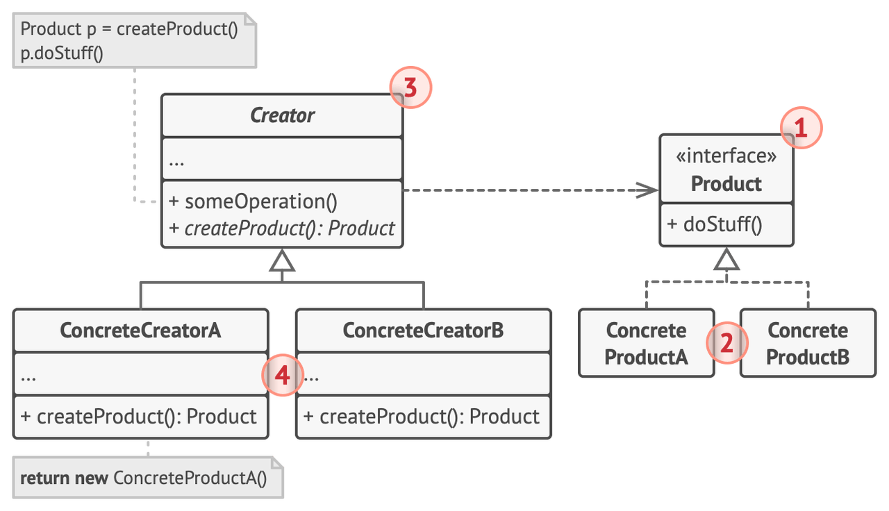

Factory method 确实解决了扩展能力的问题，在仅有少数增加的种类时(比如第三方库留给用户的扩展功能)，其表现非常好。

但是当依赖项的种类逐渐增加，甚至出现多个正交的依赖项种类同时增加时，新的 Creator 子类就会指数级增加，代码仍然会变得十分复杂。这是 Factory 模式不可避免的问题。

> 之前 [Extrac Class](https://xn4zlkzg4p.feishu.cn/docx/Kf2Gd8GcTob1iUxiw2ScwN0anGh#VAimdWooio2qKCxMnhpcgairnmf) 提出，将正交的扩展方向分出一个作为依赖
>
> 但是如果使用 factory 模式，依赖的注入也会通过继承来实现，相当于把皮球又踢了回来

暂且放下这个不可避免的难题不谈，在平行依赖项增加时，自然 Creator 中的 factory method 也会增加，当注入项过多时，注入这一步本身也变得麻烦了。

从单一职责原则的角度考虑，Creator 应该主要负责 Client Code 部分的逻辑，注入可以算作额外的工作，所以我们要想办法将其分离出去。

- 为此，我们可以将所有的 factory method 提取成一个 `IFactory` 接口，通过实现各个 factory method 来组成一个实现该接口的 `Factory` 类。
- 得益于这个接口的统一，原来多个抽象 Product 依赖变成了一个抽象 Factory 依赖。
- 这个 Factory 就类似于原来 Factory Method 中的 Product 。我们的 Creator 类就不需要那么多 factory method，只需要一个生产 “factory” 的 factory method 就够了。

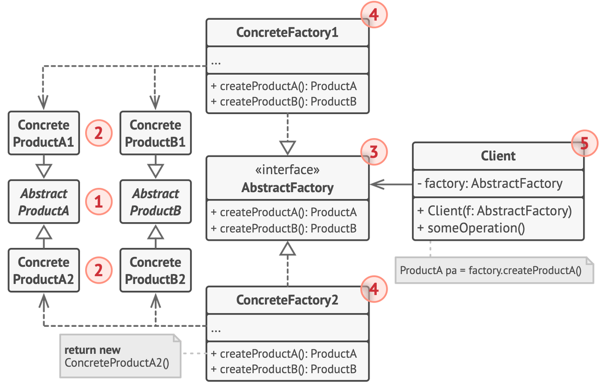

这便是所谓的 **Abstract Factory** 模式。

> 虽然 refactoring.guru 中认为 golang 因为没有继承无法实现 factory 模式，只能停留在 simple factory
>
> 但是品一品 “ 继承只是一种复用代码的方式 ” 这句话，我觉得 golang 应该是能实现的
>
> 之后有空了把代码贴出来

#### Builder

Builder 模式用于优化创建实例的复杂逻辑。

这种模式其实很常见：

```C#
var car = CarBuilder.setWheels(4)
                    .setSeats(1)
                    .setEngine(new engine)
                    .build()
```

上图这种链式调用是 builder 模式的一种常见形式。

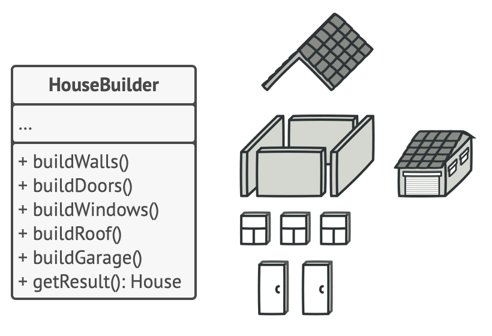

Builder 模式将创建过程分步进行，相比一次性接收所有初始化参数后返回对象的 constructor，这种形式显然更清晰易懂，便于维护。对于有多种 “可选创建模式” 的类，使用 builder 构建可以避免出现大量的 constructor。而对于创建逻辑比较复杂的类，譬如链状或者树状组合的类，builder 能将复杂的创建流程简化成人能看的地步。

Builder 模式的一个缺点是其没法从语法上确保创建流程的完整，需要调用者自己记住 build 的流程。一般来说，我们会在最后的 build 步骤加上一些完整性检验作为最后保险。

```C#
public class Builder
{
    // ...

    public IProduct build()
    {
        if(checkIntegrity(this))
        {
            throw Exception("Incomplete product");
        }

        return new Product(this);
    }

    // ...
}
```

Builder 模式不止能用来创建新实例，还可以应用在很多创建场合增加易读性。使用过 gorm 的人应该不陌生，gorm 的链式调用其实就是一个 builder. 其中，`where` 等方法相当于在设置最终的 sql 语句，而执行性的 `find` 等方法调用时，gorm 才会生成一个 sql 语句交给数据库执行。

```Go
db.Table("tableName").Where("id = ?",id).Limit(10).Find(&result)
```

#### Prototype

在实际应用中，经常出现对象的复制行为。

我们知道，由于可能出现大量的引用类型和 private 成员，直接复制对象是不太可能的。重新创建一个对象也可能是一件非常复杂的事情，在对对象内部不知情的情况下，可能需要用反射遍历所有字段进行复制。

但是，对象本身拥有其所有成员的访问权限，可以直接遍历字段进行复制。所以，不如把复制工作交给对象本身。

```Python
class Prototype:
    def __init__(self):
        self.int_member = 1
        self.list_member = []

    def clone(self):
        newObj = self.__class__()
        newObj.int_member = self.int_member
        newObj.list_member = copy.deepcopy(self.list_member)
        # iterate all members
        return newObj
```

### 更多设计模式

这些设计模式更偏向一个 “有趣的点子”

**可能需要更多的实际例子来介绍应用场景。**

#### Wrapper

对于面向接口的编程来说，经常有实际组件对不上设计好的接口的情况。

如果不想修改接口和接入的代码，一般会选择对接口进行一个 “包装”。使用一个 `Wrapper` 类来实现所需要的接口，然后将实际功能 delegate 给原来的组件。

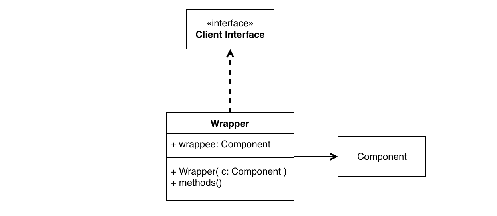

有很多设计模式本质都是一个 wrapper。

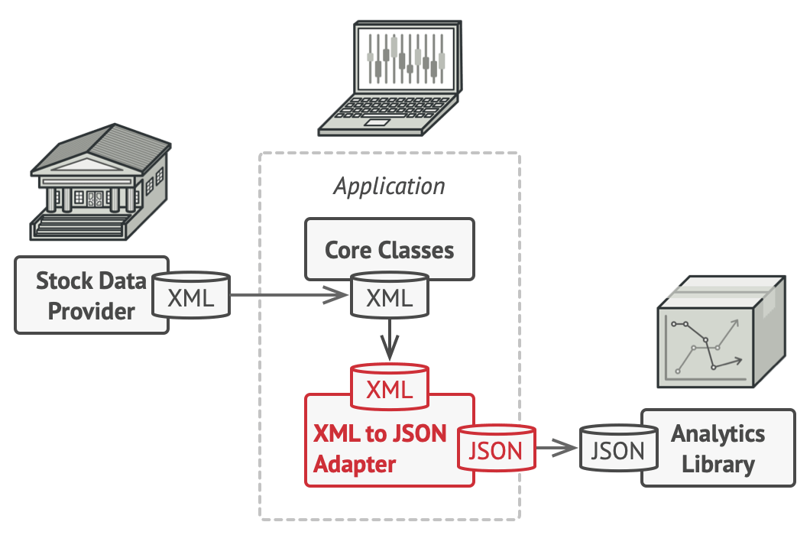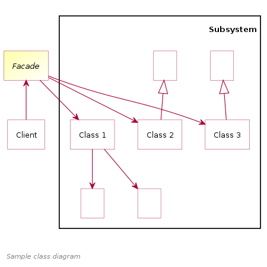

**Adapter** 通过一个 wrapper 类来对接两个接口之间的功能。**Facade** 类似于用一个较简单的接口调用一个复杂组件的功能。**Proxy** 模式则是利用 wrapper 进行一些统一管理，比如进行 log 或者控制缓存。


有时候，包装前后的接口其实是一样的，我们只是想在原来接口执行的前后增加功能，这种模式被称为 **Decorator.**

#### Chain of Responsibility

责任链模式是一种分离职责的做法。

这种模式将一个需要处理的事件抽象成一个 `event` 接口，然后再将处理事件的函数通进行链状储存。每当有一个新的事件需要处理时，一个 `event` 实例会被从链头的方法开始被处理，然后逐个交给之后的处理方法处理。


上图的处理方法之间是单向关系，我们也可以使用类似 **decorator**的形式，让整个处理链变成包含关系。

责任链也可以不必是链状的，只需要实现一个 **Iterator ，**处理函数可以被连接成树状或者其他数据结构。

#### Composite

Composite 是一种树状结构。

这种结构类似于一个军队的管理体系，整个军队的士兵和编制都实现同一个 “行动” 接口，对于士兵来说，这个接口就是执行进攻命令，对于军官来说，这个接口需要先将命令传达给下级士兵，然后再执行命令。而指挥官进行指挥时，只需要对比较顶层的编制进行下令，就能命令整个军队。

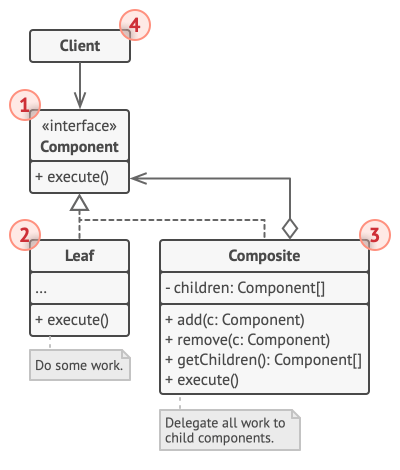
